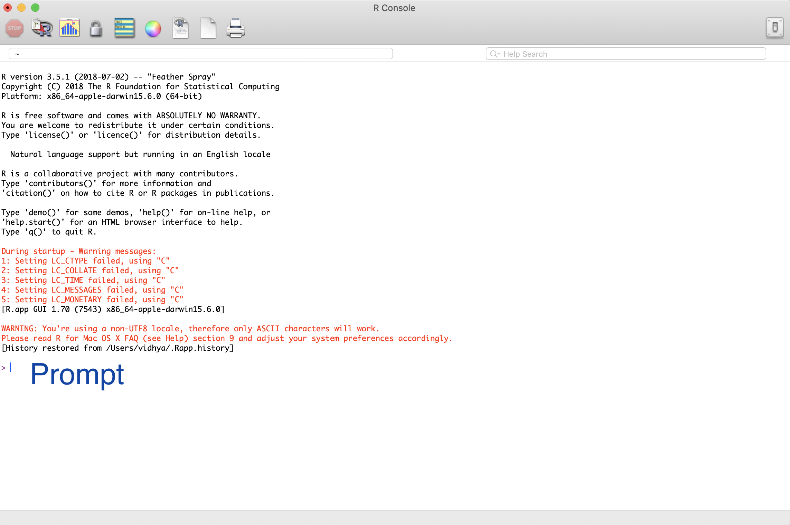
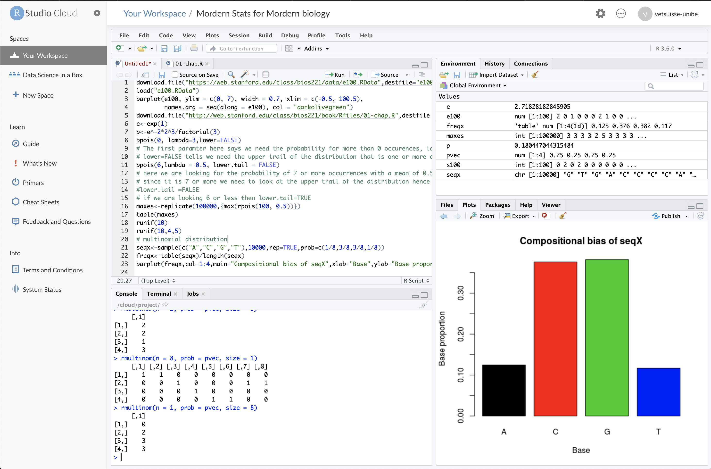
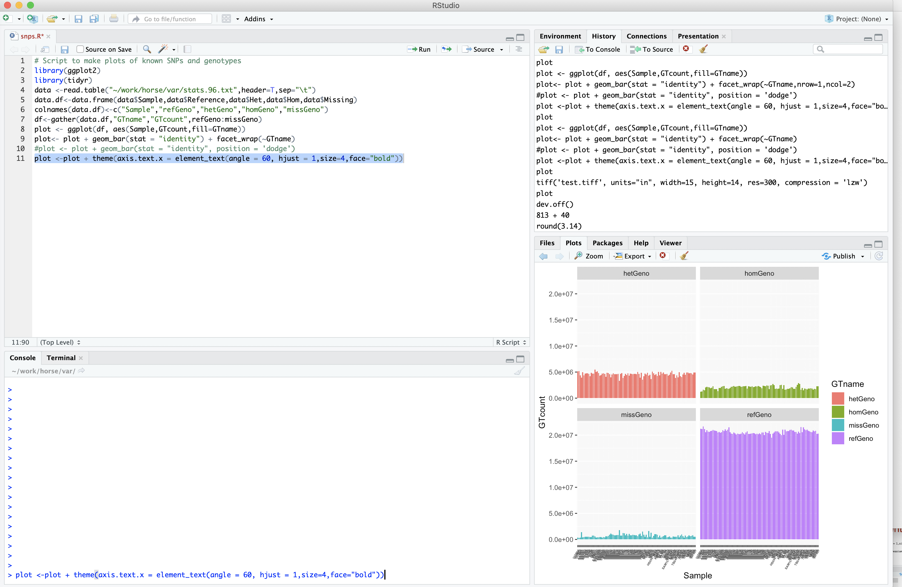
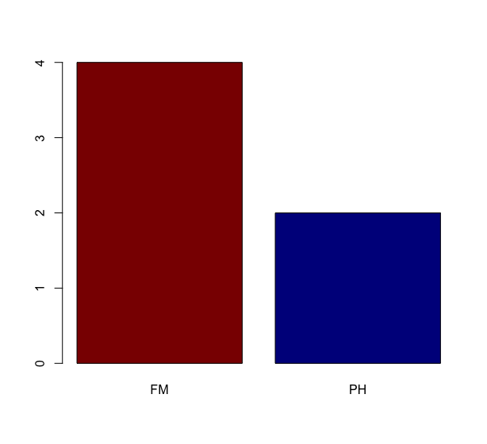
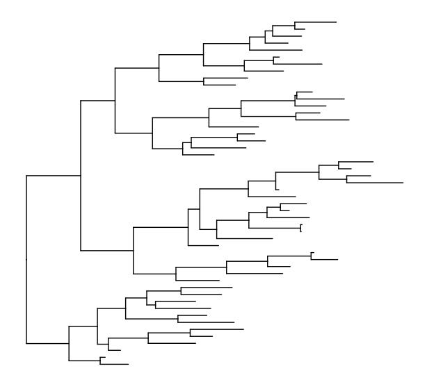
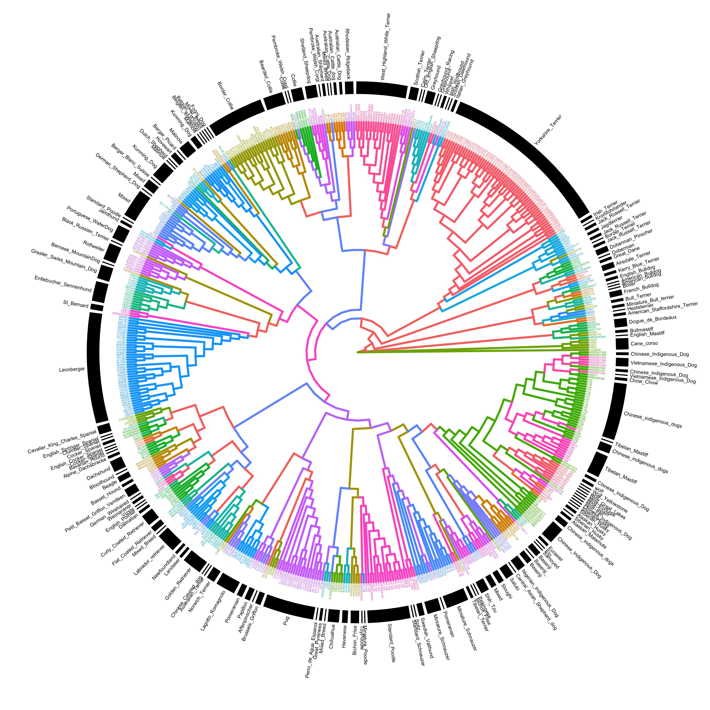

# Introduction to R and Rstudio 
### R 
1. R is a free, open-source software developed as an environment for statistical computing and graphics
2. R has been around since 1995, and was created by Ross Ihaka and Robert Gentleman at the University of Auckland, New Zealand
3. R is free means versions of R can be obtained without charge and can be redistributed to others. 
4. The [slide deck](https://www.stat.auckland.ac.nz/~ihaka/downloads/Massey.pdf) from Ross Ihaka gives you more info on the history of the development of R 
## R interface 
By default R application has a command-line interface 

We have a better interface developed now 

### RStudio
1. RStudio provides a graphical interface to R. 
2. Has several useful features that makes using R easier 
3. There are two versions of RStudio:
     [RStudio Server](https://login.rstudio.cloud/), a version of RStudio that can be accessed in a web browser. 
     

<p float="left">
  
  
</p>

**Desktop version of RStudio** that could be downloaded as standalone software.

Rstudio panels consist of :  
1. A console panel where functions can be executed
2. A text editor, where R commands can be recorded and saved for later reference.
3. A history panel which contains all the commands which were executed on the console.
4. A panel for plots.
5. Help panel for R functions. 



### Working with R 
1. Open RStudio and in the console panel type 2+3 and you see calculate the result for you 
```
>2+3
[1] 5
> 2+3*5
[1] 17
```

2. R like unix has several functions to do data analysis 
For example the function round, rounds of a number 
```
>round(3.14)
[1] 3
```
```
>sqrt(25)
[1] 5
```
```
> log10(10)
[1] 1
> log2(10)
[1] 3.321928
```


#### Basic concepts 
##### Objects/Variables 
* We can store the data in named data structures which are called as Objects or Variables in R 
for example 
```{r, eval = FALSE}
> width<-5
> length<-5
> area <- width * length
> area 
[1] 25
```
There are several different types of data structures or objects in R
##### Vectors
* Vectors are simplest data objects
* Vector is a collection of values. The values can be number or charcters. 
* Vectors can hold values of only the same type.
* Vectors are created using the function c()
```{r, eval = FALSE}
>genome_coOrdinates<-c(10000,17000,20000)
>genes<-c("FGF4","MFSD1","ASIP","TYRP1"," MLPH","MC1R","DEFB103")
```
* Vectors are also indexed 
```{r, eval = FALSE}
>genes[1]
[1] "FGF4"
>genes[7]
[1] "DEFB103"
```
* Vectors can also be easily subsetted

```{r, eval = FALSE}
> coatColorGenes<-genes[3:7]
> coatColorGenes
[1] "ASIP"    "TYRP1"   " MLPH"   "MC1R"    "DEFB103"
```
##### data frames
We usually do not have just one column of data to analyse, we have generally several columns of data in a csv or tab delimited text files. Such tabular data can be held in *data frames* in R 
```{r, eval = FALSE}
>data <-read.table("stats.96.txt",header=T,sep="\t")
>head(data)
  Sample Transitions Transversions Ts.Tv Reference     Het     Hom Missing
1 13TB06     4247043       2196662 1.933  21225037 5157606 1215093  351958
2 13TB13     4333343       2261476 1.916  21164148 5192923 1290785  301838
3 14TB04     4200784       2207764 1.903  21637033 4356528 1600189  355944
4   1801     3829568       2048858 1.869  21175146 3903345 1486161 1385042
5 AKT001     5140837       2674988 1.922  20532183 4969232 2051310  396969
6 AKT003     4990883       2542538 1.963  20942451 4388812 2152141  466290
``` 
* Data frames contain tabular data 
* The tabular data can be numeric or characters.
* Like tabular data every data frame has rows and columns. This can be determined using the function *dim* short for dimensions

```{r, eval = FALSE}
>dim(data)
[1] 97  8
```
```{r, eval = FALSE}
> summary(data)
     Sample    Transitions      Transversions         Ts.Tv         Reference             Het         
 13TB06 : 1   Min.   :3829568   Min.   :2048858   Min.   :1.869   Min.   :19531688   Min.   :3343926  
 13TB13 : 1   1st Qu.:4730150   1st Qu.:2409363   1st Qu.:1.953   1st Qu.:20297089   1st Qu.:4412825  
 14TB04 : 1   Median :5023144   Median :2555046   Median :1.965   Median :20594472   Median :4630139  
 1801   : 1   Mean   :4989340   Mean   :2541629   Mean   :1.963   Mean   :20613338   Mean   :4591911  
 AKT001 : 1   3rd Qu.:5277402   3rd Qu.:2674988   3rd Qu.:1.978   3rd Qu.:20845897   3rd Qu.:4807139  
 AKT003 : 1   Max.   :5746966   Max.   :2944700   Max.   :2.006   Max.   :21637033   Max.   :5490776  
 (Other):91                                                                                           
      Hom             Missing       
 Min.   :1215093   Min.   : 301838  
 1st Qu.:1802825   1st Qu.: 472742  
 Median :2092724   Median : 681564  
 Mean   :2046213   Mean   : 698232  
 3rd Qu.:2276082   3rd Qu.: 822241  
 Max.   :2907313   Max.   :1796621  
 ```
 * data frames can also be subset like vectors.  

 ```{r, eval = FALSE}
>data <-data[,c(2:8)]
> summary(data)
Transitions      Transversions         Ts.Tv         Reference             Het               Hom         
 Min.   :3829568   Min.   :2048858   Min.   :1.869   Min.   :19531688   Min.   :3343926   Min.   :1215093  
 1st Qu.:4730150   1st Qu.:2409363   1st Qu.:1.953   1st Qu.:20297089   1st Qu.:4412825   1st Qu.:1802825  
 Median :5023144   Median :2555046   Median :1.965   Median :20594472   Median :4630139   Median :2092724  
 Mean   :4989340   Mean   :2541629   Mean   :1.963   Mean   :20613338   Mean   :4591911   Mean   :2046213  
 3rd Qu.:5277402   3rd Qu.:2674988   3rd Qu.:1.978   3rd Qu.:20845897   3rd Qu.:4807139   3rd Qu.:2276082  
 Max.   :5746966   Max.   :2944700   Max.   :2.006   Max.   :21637033   Max.   :5490776   Max.   :2907313  
    Missing       
 Min.   : 301838  
 1st Qu.: 472742  
 Median : 681564  
 Mean   : 698232  
 3rd Qu.: 822241  
 Max.   :1796621  
 ```
 #### factors 
* The third data structure in R is called as factors. 
* factors are vectors containing categorical data 
```{r, eval = FALSE}
>horses<-data.frame(samples=c("13TB06","13TB13","14TB04","1801","AKT001","AKT003"),breed=factor(c("FM","FM","FM","FM","PH","PH"))
>levels(horses$breed)
>plot(horses$breed)
```


### R Packages 
* R software has a lot of in-built functions for data analysis.
* In addition there are a lot of many specialized tools developed as packages by a large  number of people belonging to the R community. 
* for example the package *ggplot2* is R's famous package for making beautiful graphics for a variety of data.  *ggtree* allows you to make beautiful phylogenetic trees. 
* Typically, a package will include code, documentation for the package and for the functions inside, some tests to check everything works as it should, and data sets.
* The function install.packages() is used to install the required packages 
* The function library() is used load the package and access the tools in the packages. 

```
>install.packages("ggplot2")
>library("ggplot2")
>library("ggtree")
> set.seed(2017-02-16)
> tree <- rtree(50)
> ggtree(tree)
```


* A more elaborate phylogenetic tree of dog breeds 


#### Bioconductor packages 
* A source for most bioinformatics libraries and tools 
* The web site at https://bioconductor.org contains descriptions of all _Bioconductor_ packages, also includes vignettes for packages containing examples from beginner to advance level. 
* Packages available in _Bioconductor_ are summarized at https://bioconductor.org/packages. They are four different types of Bioconductor packages 
    * **'Software packages'**  provide implementation of algorithms (e.g. statistical analysis), access to resources (e.g. biomart, or NCBI) or visualizations (e.g. volcano plots, pathways plots). 
    * **'Annotation packages'** contain data that allows for cross mapping between several databases like Entrez, ensembl, GO ontology databases. 
    * **'Experiment data packages'** include contain curated data from an experiment, teaching course or publication and in most cases contain a single data set.
    * **'Workflow packages'**  describe a bioinformatics workflow that involves multiple Bioconductor packages. Ex: rnaseqGene by Michael Love. Its a RNA-seq workflow: gene-level exploratory analysis and differential expression.

##### Installation
_Bioconductor_ packages are installed differently from install.packages() function
The first step is to install the *BiocManager* package

```{r, eval = FALSE}
if (!requireNamespace("BiocManager", quietly = TRUE))
    install.packages("BiocManager", repos="https://cran.r-project.org")
```
The next step is to install the desired _Bioconductor_ packages. The syntax to install SRAdb packages which allows you to search and download the public NGS datasets.

```{r, eval = FALSE}
BiocManager::install("SRAdb")
```

#### Help 
* Each package has a separate webpage ex., https://bioconductor.org/packages/release/bioc/html/SRAdb.html. The page contains a description of the package, authors, perhaps literature citations where the software is described, and installation instructions.

* _Bioconductor_ packages vignettes are availble from package web page, and can also viewd within _R_ using

```{r, eval = FALSE}
browseVignettes("GenomicRanges")
```

* Bioconductor community has also added many course materials including lecture videos, slides and exercises. 
https://bioconductor.org/help/course-materials

