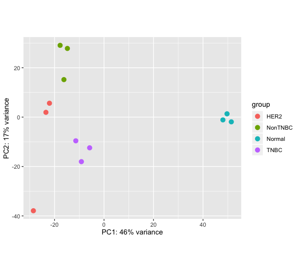
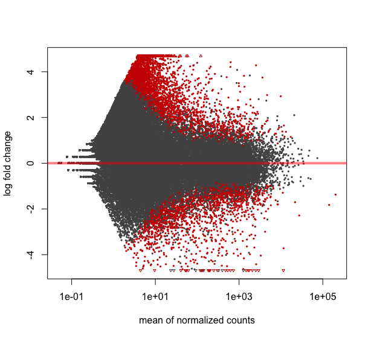
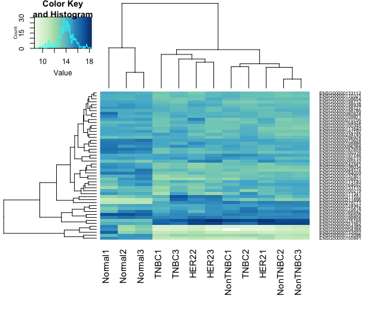

#### Differential expression using RNA-seq 
For this exercise we will use the datasets from the study [GSE52194](https://www.ncbi.nlm.nih.gov/geo/query/acc.cgi?acc=GSE52194)

The results of the analysis of this dataset had been published in the following paper https://www.nature.com/articles/srep01689

We will use a subset only for the analysis. 

1. Fastq files can be downloaded through Gene Expression Omnibus (GEO): GSE52194 (https://www.ncbi.nlm.nih.gov/geo/query/acc.cgi?acc=GSE52194)
2. The libaray layout is paired sequencing
3. Library prep protocol did not preserve information on the transcribed strand. (non-stranded)

Background: 

3 samples each from normal breast tissue and 3 different breast cancer subtypes:
- Triple negative
- HER2 positive
- Non-triple negative (Luminal A/B)

##### Tasks

1. Assess read number and quality 
2. Map the reads to the human reference genome GRCh38 
3. Count the number of reads overlapping annotated genes 
4. Test for differential gene expression between tumor subtypes 
5. Login to binfservms01 using putty

In order reduce run times again we have subset of clean reads only for chr22 at _/data/courses/courseB/RNA-seq/reads_

#### Mapping 
Create a directory called RNA_seq and mapping under it 

```
mkdir -p RNA_seq/mapping 
cd RNA_seq/mapping 
```
Copy any of the two paired-end reads samples from original folder/data/courses/courseB/RNA-seq/reads to your mapping folder in the following manner.

```
cp /data/courses/courseB/RNA-seq/reads/*_R*.fastq.gz  . 
```
These RNA-seq reads are human breast cancer samples so we will need to map them to human reference genome (GRCh38). Using the [HiSat2 algorithm](https://ccb.jhu.edu/software/hisat2/manual.shtml). HiSat2 is the next development of TopHat2. HiSat2 is BWT based algorithm, the difference being that it uses 2 different types of indexing system instead of one. The two different indexes are global and local indexes which are used for exon mapping reads and reads spanning one or more junctions respectively. 

Write a job script and submit the mapping job tot he cluster using sbatch.

```
#!/bin/bash
#SBATCH --time=3:00:00
#SBATCH --mem=16G
#SBATCH --output=hisat2.out
#SBATCH --error=hisat2.err
#SBATCH --job-name=hisat2
#SBATCH --cpus-per-task=4
#SBATCH --partition=pcourse80

module add UHTS/Aligner/hisat/2.1.0;
hisat2 -x /data/courses/courseB/RNA-seq/reference/Homo_sapiens.GRCh38.dna.chromosome.22  -1 /data/courses/courseB/RNA-seq/reads/HER21_chr22_R1.fastq.gz -2 /data/courses/courseB/RNA-seq/reads/HER21_chr22_R2.fastq.gz -S HER21.sam -p 4
```
The output from hisat2 is a sam file which needs to be converted to a bam file and sorted by chromosome co-ordinates for all downstream analysis

#### Task 
Write a job script to convert the sam to bam file using _samtools view_ and _samtools sort_ 

```
#!/bin/bash
#SBATCH --time=3:00:00
#SBATCH --mem=16G
#SBATCH --output=bam.out
#SBATCH --error=bam.err
#SBATCH --job-name=view2bam
#SBATCH --cpus-per-task=8
#SBATCH --partition=pcourse80

module add vital-it;
module add UHTS/Analysis/samtools/1.8;

samtools view -@8 -h -Sb -o HER21.bam HER21.sam 
samtools sort -@8 HER21.bam HER21.sorted.bam

```


It is very important to check every step of your analysis. Does the output make sense? Is the quality of the results good enough to continue with the analysis? To check the mapping, have a look at the summary statistics Hisat2 wrote to the error file. 

The mapping stats for all files are available here /data/courses/courseB/RNA-seq/mappingstats. 

Use those files and unix command line tools to answer the following questions 
- What is the highest/lowest overall alignment rate?
- What is the minimum/maximum number of reads that aligned concordantly and to a unique location of the genome? 

#### Count reads 
To count the number of reads overlapping annotated genes we will use the featureCounts algorithm. http://bioinf.wehi.edu.au/featureCounts/

For this feature count exercise we have made the sorted bam files already available for all the samples. You can use this as input to feature count. 

```
#!/bin/bash
#SBATCH --time=10:00:00
#SBATCH --mem=16G
#SBATCH --output=featureCounts.out
#SBATCH --error=featureCounts.err
#SBATCH --job-name=featureCounts
#SBATCH --cpus-per-task=8
#SBATCH --partition=pcourse80

module add vital-it;
module add UHTS/Analysis/subread/1.6.0;

featureCounts -p -C -s 0 -T 8 -Q 10 --tmpDir .  -a  /data/courses/cancergenomics/RNAseq_CancerGenomics_2019/chr22/reference/Homo_sapiens.GRCh38.98.gtf -t exon -g gene_id  -o output.txt  /data/courses/cancergenomics/RNAseq_CancerGenomics_2019/chr22/mapped/HER21.coordSorted.bam /data/courses/cancergenomics/RNAseq_CancerGenomics_2019/chr22/mapped/HER22.coordSorted.bam /data/courses/cancergenomics/RNAseq_CancerGenomics_2019/chr22/mapped/HER23.coordSorted.bam /data/courses/cancergenomics/RNAseq_CancerGenomics_2019/chr22/mapped/NonTNBC1.coordSorted.bam /data/courses/cancergenomics/RNAseq_CancerGenomics_2019/chr22/mapped/NonTNBC2.coordSorted.bam /data/courses/cancergenomics/RNAseq_CancerGenomics_2019/chr22/mapped/TNBC3.coordSorted.bam /data/courses/cancergenomics/RNAseq_CancerGenomics_2019/chr22/mapped/Normal1.coordSorted.bam /data/courses/cancergenomics/RNAseq_CancerGenomics_2019/chr22/mapped/Normal2.coordSorted.bam /data/courses/cancergenomics/RNAseq_CancerGenomics_2019/chr22/mapped/Normal3.coordSorted.bam /data/courses/cancergenomics/RNAseq_CancerGenomics_2019/chr22/mapped/TNBC1.coordSorted.bam /data/courses/cancergenomics/RNAseq_CancerGenomics_2019/chr22/mapped/TNBC2.coordSorted.bam /data/courses/cancergenomics/RNAseq_CancerGenomics_2019/chr22/mapped/TNBC3.coordSorted.bam
```
The parameters used for featureCount is as follows:  
- -p the read sequence is paired-end data.
- -C If specified, the chimeric fragments (those fragments that have their two ends aligned to different chromosomes) will NOT be counted. This option should be used together with -p (or isPairedEnd in Rsubread featureCounts) 
- -s Indicate if strand-specific read counting should be performed 0 (un- stranded), 1 (stranded) and 2 (reversely stranded) 
- -T Number of the threads. 
- -Q The minimum mapping quality score a read must satisfy in order to be counted. 
- --tmpDir Directory under which intermediate files are saved (later re- moved) 
- -a annotation file to be used for counting
- -t Specify the feature type 
- -g Specify the attribute type used to group features (eg. exons) into meta-features (eg. genes) 

Check the output of featureCounts to address the following questions:
- What proportion of reads overlaps with annotated genes in each sample?
- How many reads, on average, are unassigned due to ambiguity? Can you think of situation when it may not be possible to assign a read unambiguously to a particular gene?
- How many reads, on average, are unassigned due to multimapping? What does this mean?


#### Differential expression. 

We will use the count file to study differential expression of genes in the three breast cancer sub-types with R package called [DeSeq2](http://bioconductor.org/packages/release/bioc/html/DESeq2.html) 

For convience we have produced the full feature count file for all chromosomes, for all the samples,  ready to use for differential expression with R. 

Create a local directory as _diffExp_ and transfer the files to the directory using _scp_

```
scp student51@binfservms01.unibe.ch:/data/courses/courseB/RNA-seq/counts/breastCancer.counts.forDESeq.txt .
```

If you are not able to use scp. Create a local directory as _diffExp_ and  can download the count file from the following link to the _diffExp_ directory. 

```
https://campuscloud.unibe.ch:443/ssf/s/readFile/share/40219/-283556994276692082/publicLink/breastCancer.counts.forDESeq.txt
```

Open R studio and in the text editor panel add the following R commands and run the commands in the console window.
The first two lines below are to install the DeSeq2 package. If don't have it already.

```
if (!requireNamespace("BiocManager", quietly = TRUE))
    install.packages("BiocManager")

BiocManager::install("DESeq2")

library(DESeq2)
```
##### Prepare the data for analysis. 
1. Read in data table. Reformat so that it contains the Geneid as rownames and only the counts as columns. It is also a good idea to simplify the column names (if you haven’t already done this)

2. Create a data frame containing the experimental group of each sample

3. Create the DESeqDataSet object

Note: the first command in R **setwd** should be given the full path to your _diffExp_ folder.  

```
setwd("diffExp")
countData<-read.table('breastCancer.counts.forDESeq.txt', header=TRUE)
rownames(countData)<-countData$Geneid
countData<-countData[, -1]
colnames(countData)<-sub(".*\\.bamfiles\\.([A-Za-z1-3]*)\\.coordSorted\\.bam", "\\1", colnames(countData))

sampleGroup<-sub(".$", "", colnames(countData)) # remove the last character (= replicate number) from the sample name to end up with subtype
colData<-data.frame(condition=factor(sampleGroup))

dds<-DESeqDataSetFromMatrix(countData, colData, formula(~condition))
```
##### Perform the differential expression analysis

```
dds<-DESeq(dds, betaPrior = TRUE)
res <-results(dds)
head(res)
```
#### Visualize results
Plot 1: PCA using the 500 most variably expressed genes
```
rld <-rlog(dds, blind=TRUE) # apply a regularized log transformation, ignoring information about experimental groups
p<-plotPCA(rld, intgroup=c("condition"))
print(p, ntop=500)
```

Plot 2: Mean expression against log-fold change. Genes with p-adjusted below alpha will be shown in red, all others in grey

```
plotMA(res, alpha=0.05)
```

Plot 3: Heatmap using the 50 most highly expressed genes
```
library("RColorBrewer")
library("gplots")
select <- order(rowMeans(counts(dds,normalized=TRUE)),decreasing=TRUE)[1:50]
hmcol <- colorRampPalette(brewer.pal(9, "GnBu"))(100)
heatmap.2(assay(rld)[select,], col = hmcol, trace="none", margin=c(10,6),labCol=colnames(dds), cexRow = 1/log10(length(select)))
```



**Optional task: Try to recreate the VOLCANO PLOT looking at the [manual](http://bioconductor.org/packages/release/bioc/html/DESeq2.html).**

#### Pairwise contrasts 
Now take a closer look at the results and the normalised count data:

```
head(res)
head(counts(dds, normalized=TRUE))
```
The log2FoldChange is approximately the mean of the normalised counts for condition 1 over the mean of the normalised counts for conditions 2 (“approximately”, because of the shrinkage explained in the lecture)

In our dataset, we have more than 2 groups, i.e. our factor “condition” has more than 2 levels. In this situation, DESeq2 by default outputs a comparison of the last level of the factor over the first level (in alphabetical order), in our case TNBC vs HER2 (see “Note on factor levels” in DESeq2 vignette)

We can explicitly specify which levels we want to compare, as follows:

```
TNBC_HER2 <-results(dds, contrast=c('condition', 'TNBC', 'HER2' ))
```

Let’s double-check that this really produces exactly the same results as before by comparing the log2 fold changes:

```
plot(res$log2FoldChange, TNBC_HER2$log2FoldChange, xlab='first analysis', ylab='second analysis')
```

**Extra task: Perform some of the other pairwise comparisons that are possible for this dataset**

#### Export the results to a tab-delimited file

Our variable ‘res’ contains only the results from the test for differential expression. Before we export this as a table, we add the original counts for each gene in each sample. We then export the original table and a table sorted by adjusted P-values

```
combined <- cbind(counts(dds), as.data.frame(res)) # This assumes that the genes are in the same order in both tables!
# alteratively, we could use the normalised counts by using counts(dds, normalized=TRUE)
write.table(combined, 'MyResults.txt', quote=FALSE, row.names=TRUE, sep='\t')
write.table(combined[order(combined$padj),], 'MyResults_sorted.txt', quote=FALSE, row.names=TRUE, sep='\t')
```