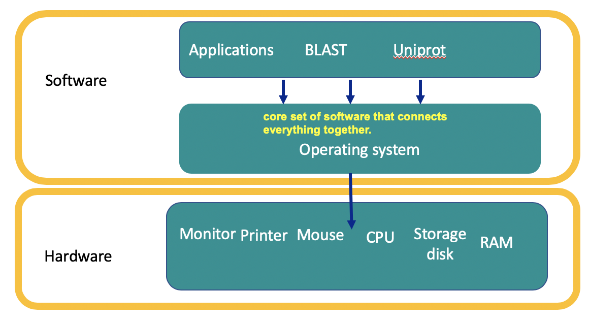
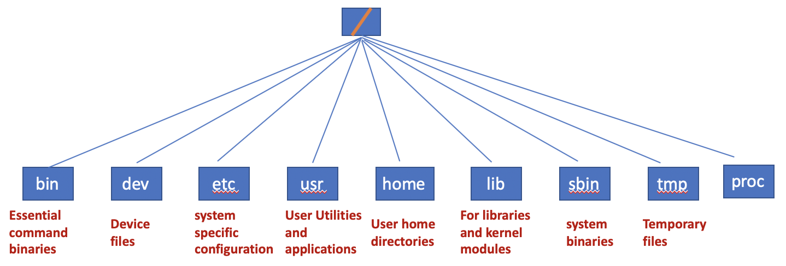
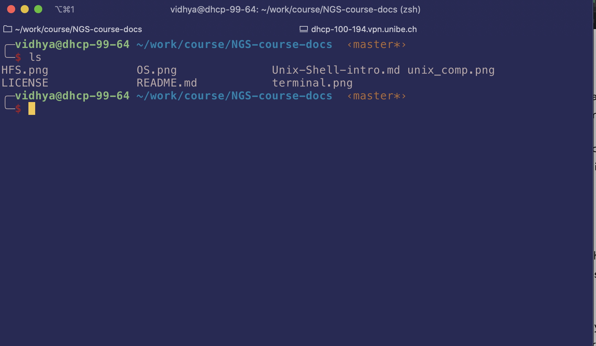
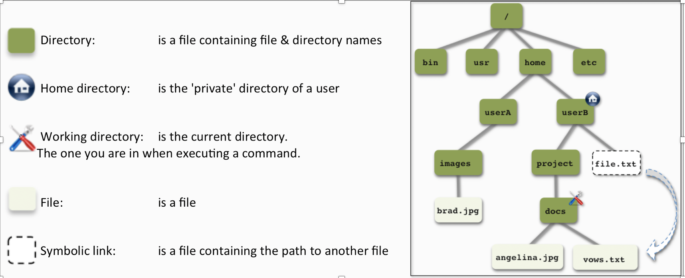
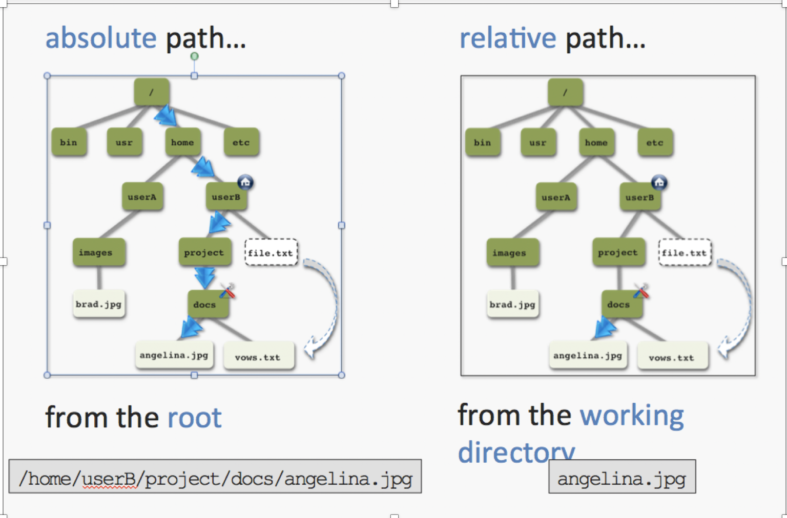

# Goals & Objectives 
This lesson provides a very **brief** introduction to the Unix OS shell for new users, or a quick refresher for those who have used it before. 
I also provide give additional resources where you can learn more about it and also practice. 

### Objectives:
1. What is Unix
2. Why Unix and Linux
3. The Philosphy of Unix
4. Shell  
5. Command line 
6. Flavours of Linux
7. Exercises with Command Line

## Unix 
Unix is an **operating system**. 

#### Operating System:

"The basic software that allows the computer to move information from one place to another and communicate with peripheral devices in an orderly way"- 
 *Glenn Weadock Exploding the computer myth (1995)*




## Why Unix and Linux 
Unix and Unix like systems such as Linux power a amazing range of systems from the enterprise to home. 
1. Unix systems are stable 
2. Easy to manage remotely 
3. Perform well in demanding situations 

# Unix systems are used as both servers & workstations 
All Unix systems share a number of common characteristics 
1. Plain text files are used for data storage.
2. Hierchichal file system 

3. Everything is a file 
*Displays your CPU info exposed as a file*

```
cat /proc/cpuinfo    
processor       : 0
vendor_id       : GenuineIntel
cpu family      : 6
model           : 62
model name      : Intel(R) Xeon(R) CPU E5-2620 v2 @ 2.10GHz
.
.
.
processor       : 1
vendor_id       : GenuineIntel
cpu family      : 6
model           : 62
model name      : Intel(R) Xeon(R) CPU E5-2620 v2 @ 2.10GHz  

```
4. Several small programs doing one thing, can be put togther (more of this later)
5. It is easy to automate tasks in UNIX: simply write the commands you would type in a text file and run it.
6. Multi-User and multi-tasking system

## Unix Shell
1. The shell is a application that allows user to control the computer using other programs.
2. The control is done by typing commands and not by clicking the mouse.
3. The shell in turn calls the OS to execute the commands.  
4. Hence the unix shell is both a command-line interface (CLI) and a scripting language

## How to access the shell on linux 
1. We access the shell via a terminal which is *usually* a black & white window in most unix systems today. 
2. When you type *ls* into the shell, you are asking the shell to run the “ls” program and to print out a list of files in the current directory to your terminal

3. You could also write a slew of commands in a text file and run them one after another. That's why the shell is also called a scripting language.
4. The prompt is a symbol or a series of characters at the beginning of a line. It indicates that the system is ready to receive input from the user via the keyboard


## Command Line
The programs we type at the prompt to be executed are also called as command-line programs. 
We will use the *ls* command to understand some common rules and terms for these command line programs 
# Basic commands rules
*ls* lists the files and sub-directories in a folder. 
```
ls
```
Now if want to see the time stamp of the file then we can pass an argument to ls 
```
ls -l
total 5480
-rw-r--r--@ 1 vidhya  staff   175534 Oct 28 17:43 HFS.png
-rw-r--r--  1 vidhya  staff     1072 Oct 23 12:11 LICENSE
-rw-r--r--@ 1 vidhya  staff   185374 Oct 24 13:01 OS.png
-rw-r--r--  1 vidhya  staff      108 Oct 23 12:11 README.md
-rw-r--r--  1 vidhya  staff     8563 Nov  4 17:36 Unix-Shell-intro.md
-rw-r--r--@ 1 vidhya  staff   194345 Nov  4 17:16 terminal.png
-rw-r--r--@ 1 vidhya  staff  2223478 Oct 28 10:20 unix_comp.png
```
Here without the space/or the dash, it will throw an error 
```
ls-l
zsh: command not found: ls-l
```
```
ls l
ls: l: No such file or directory
```
and when you type *ls* is case-sensitive 
```
LS
command not found: LS
```
You could also add file name as arugment to the ls command 
```
ls -l OS.png

-rw-r--r--@ 1 vidhya  staff  185374 Oct 24 13:01 OS.png
```
## Commands for file and directory manipulation 
The following is a reminder of the hierarchial file structure of Unix

pwd command tells us the current work directory

```
pwd
```
The are two 
1. An absolute path is a path that describes the location of a file that starts from  the “root”. Also known as the full path.
2. A relative path is a path that describes the location of a file or folder in relative to the current working directory



In the image above if want move file.txt to the current working directory we can run the following command 

``` 
mv ~/file.txt .
```
Here it is the absoulte path where ~/ stands for the path */home/userB/*

To find where you are:
```
pwd
```
To create a directory 
```
mkdir getting_started
```
 To change directory
```
cd getting_started
```
## File management 
List the files in the directory
```
ls 
ls –lh 
```
Copy
```
cp file1.txt temp.txt
```
Move/rename
```
mv file1.txt getting_started/file1.txt 
mv file1.txt temp.txt
```
Deleting files
```
rm file1.txt
```
## Examining files 
View the contents of a file
```
cat file1.txt 
```
View content screen by screen 
```
more file1.txt
less file1.txt  
```
View the top lines of the file 
```
head file1.txt
head –n 50 file1.txt
```
View the lines at the end of the file 
```
tail file1.txt  
```

## Redirection
This shows examples for the Philosphy where small programs can be put together to do jobs more effectively 
| - pipe the output to a different program
```
cat file1.txt | head –n 10 
```
redirect the output to a file
```
head –n 100 >first_100_lines.txt
```
create or append to an existing file
```
tail –n 10 >>first_100_lines.txt 
```

## Working wiht data 
Number of lines in the file
```
wc –l file1.txt 
```
 difference in text files
 ```
diff file1.txt file2.txt 
```
sort files
```
sort  -k 1,1 –k 2,2n file1.txt >file1.sorted.txt 
```
Remove duplicate lines
```
uniq geneNames.txt >uniq.geneNames.txt
sort geneNames.txt | uniq >uniq.geneNames.txt
```
Join together 
```
paste geneNames.txt geneStart.txt geneEnd.txt >geneAnn.txt 
```
Extract the first column (field)
```
cut –f1 geneAnn.txt >geneNames.txt 
```
Search for patterns
```
grep GAPDH geneAnn.txt 

```

## Help 
For help 
```
man grep
man cut
…… 
```
What commands were excuted 
```
history >rnaSeq_analysis.txt 
```
## To remember 

1. There is no « Undo »
2. Files over written or modified cannot be returned to the primitive state
3. There is no « Trash » or « Recyle bin »
4. using rm is means permanent deletion
5. Files names are case sensitive
6. File1.txt is different from file1.txt
7. Do not use space in file names
