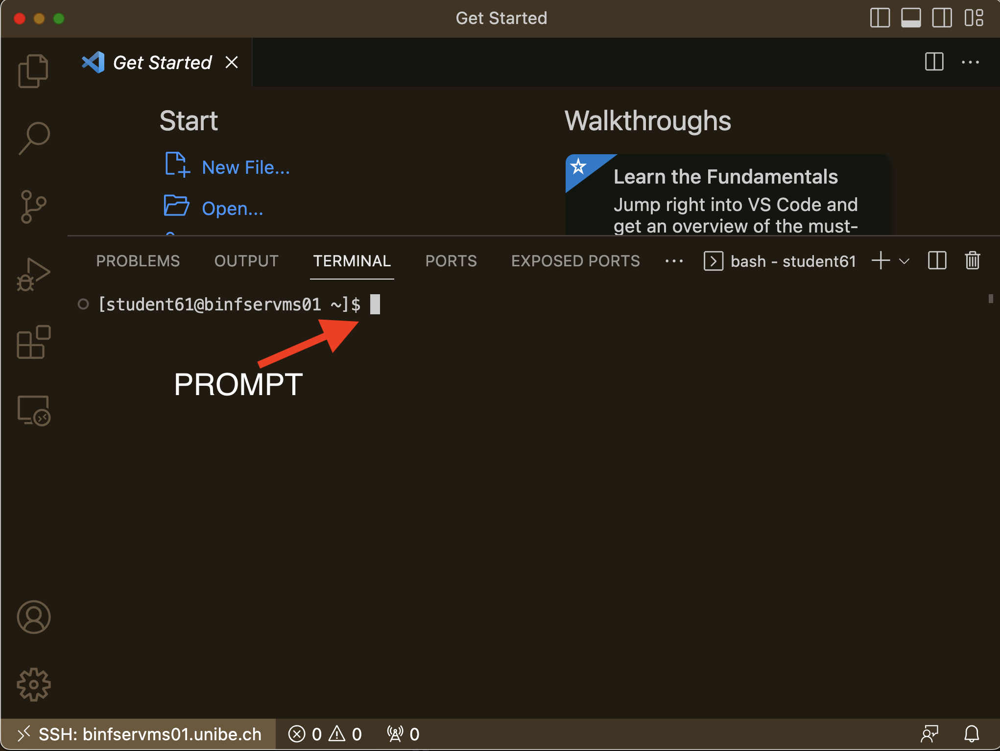

#### HPC cluster exercises 

##### Exercise 1 
In this exercises we will create a small bash script, run it locally, then submit it as a job to Slurm using sbatch, and compare the results.
We are going to create a file and add contents to it using the cat command. To close the file please press CTRL and D key together. 
If you are familiar with text file editors like vi or emacs you can use that. 

```
mkdir testDir 
cd testDir 
cat >test.sh 
#!/bin/bash
hostname
date
sleep 20
date
<CTRL-D>

ls -l test.sh 
chmod +x test.sh 
ls -l test.sh 
# This is just for demo purpose. Real work should be submitted 
# to Slurm to run on computing nodes. 
./test.sh 

sbatch -p courseb test.sh 
squeue | grep test 

```

Questions: 
1. What is the job ID of the submitted script.
2. Where is the output of the job ? 

###### Now repeat the exercise with visual studio code (VSC). 
1. open a New text file with VSC
2. add the following lines in the text file 
```
#!/bin/bash
hostname
date
sleep 20
date
```
3. save and replace the test.sh file in testDir as shown below (replace the student61 with your login)

4. Type the following commands in the terminal. 
```
sbatch -p courseb test.sh 
squeue | grep test
```

##### Exercise 2

open a text file in VSC, add the below lines and save the file test2.sh
``` 
#!/bin/bash
for i in {1..1000}; do echo $RANDOM >>randomNumbers.txt; done
sort -n randomNumbers.txt

```
Submit the job using _sbatch_

```
sbatch -p courseb -N 1 -n 1 --mem 100 -t 2:00:00 -o test2.out -e test2.err test2.sh
```
Questions: 
1. How many files has the job submission created ? 
2. What are the contents ? 

##### Exercise 3 

A better approach is defining resource allocation inside the shell script. This way you will not need to remember for the next time and simply re-run the analysis if required.

```
cat >test3.sh
#!/bin/bash
#SBATCH -p courseb # partition (queue)
#SBATCH -N 1 # number of nodes
#SBATCH -n 1 # number of cores
#SBATCH --mem 100 # memory pool for all cores
#SBATCH -t 0-2:00 # time (D-HH:MM)
#SBATCH -o test3.out # STDOUT
#SBATCH -e test3.err # STDERR


for i in {1..100}; do echo $RANDOM >> randomIntegers.txt; done
sort -n randomIntegers.txt
<CTRL-D>
```
submit the job using _sbatch_

```
sbatch test3.sh 
```

We will continue with more SLURM jobs in the rest of our exercises. 
