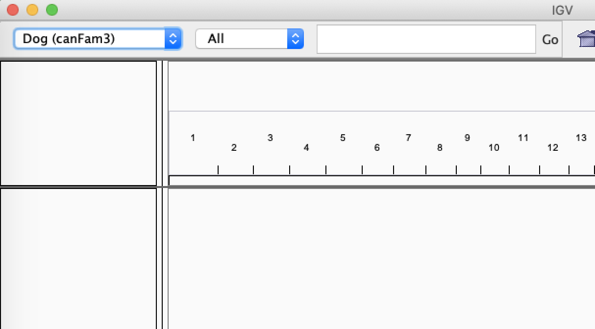
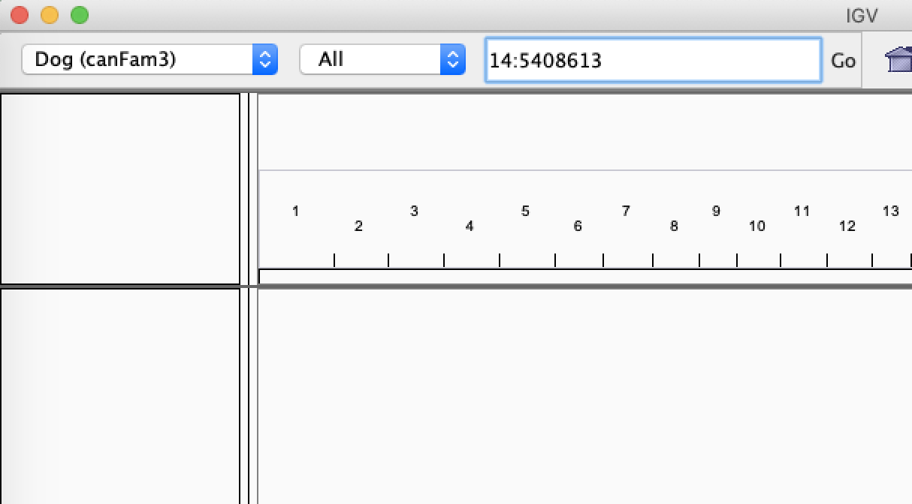

###  Map Data 
Create a folder calling course/variantCalling on the IBU binformatics server and copy the reference file 

```
cd course
mkdir variantCalling
cd variantCalling
mkdir refIdx
cd refIdx
cp /data/courses/pcourseb/variantCalling/chr14.fa .
```
We will use only chr14 of the dog genome as the reference just for short computing run times,so you can finish the exercises faster 

#### Index the reference 
We will use bwa mem for mapping the reads to the reference genome. For this we index the reference genome first. 
Load the bwa module first and by typing bwa on the commmand line you get the help for bwa. The options for bwa are also available at http://bio-bwa.sourceforge.net/bwa.shtml

```shell
module add BWA/0.7.17-GCC-10.3.0
bwa 
```
Before aligning your reads, it's crucial to index the reference genome. Here's why:

- **Faster Alignment:** Indexing helps the aligner quickly locate potential alignment sites, saving significant time.
- **Reusability:** Once created, this index can be used for all bwa alignments to the same reference.
- **New Reference = New Index:** If you change your reference genome, you'll need to build a new index.

Create a bash script for indexing the genome 

```
#!/bin/bash
# Slurm options
#SBATCH --job-name="bwaIdx"
#SBATCH --chdir=.
#SBATCH --time=1:00:00
#SBATCH --mem=5G
#SBATCH --cpus-per-task=1
#SBATCH -p pcourseb


module add BWA/0.7.17-GCC-10.3.0

bwa index -a bwtsw -p chr14.fa chr14.fa
```

#### Mapping 

We will use bwa mem algorithm for mapping. This is an algorithm that is most popular mapping but does not have a publication for it !! 

##### Genome reads 
Create and directory called course/variantCalling/mapping 
Copy the sample genome illumina reads for two  Bull Terriers dogs to the mapping directory. The Bull Terriers samples are named as: 
1. BT012 
2. BT134

```shell
cd ../
mkdir mapping 
cd mapping 
cp /data/courses/pcourseb/variantCalling/*.gz .
```
Questions: 
1. How many files got copied ? 
2. what is the format of the files ? 
3. What sequencing type was used: single-end or paired-end ?


Mapping involves three steps: 
**Do not execute the following steps**
1. Map the reads to the indexed reference genome 
```shell
bwa mem -t 8 -M -R '@RG\tID:2019111402\tPL:illumina\tPU:HHV75DSXX.4\tCN:UBern\tLB:BT134-LIB\tSM:BT134'  chr14.fa  BT134_R1.fastq.gz BT134_R2.fastq.gz >BT134.sam
```
2. Convert the sam output of the mapping to a binary bam format using _samtools view_ command
```shell
samtools view -@8 -h -Sb -o BT134.bam BT134.sam 
```
3. sort the bam based on chromosome co-ordinates using _samtools sort_ command 

```shell
samtools sort -@8 BT134.bam BT134.sorted.bam 
```

This involves a lot of reading and writing to the hard disk which is highly time consuming hence using the _piping_ power of unix we will reduce these steps to single command in the following fashion

```
#!/bin/bash
# Slurm options
#SBATCH --mail-type=fail,end
#SBATCH --job-name="mapping"
#SBATCH --chdir=.
#SBATCH --time=3:00:00
#SBATCH --mem-per-cpu=2G
#SBATCH --cpus-per-task=8
#SBATCH -p pcourseb

module load BWA/0.7.17-GCC-10.3.0
module load SAMtools/1.13-GCC-10.3.0

bwa mem -t 8 -M -R '@RG\tID:2019111402\tPL:illumina\tPU:HHV75DSXX.4\tCN:UBern\tLB:BT134-LIB\tSM:BT134'  ../refIdx/chr14.fa  BT134_R1.fastq.gz BT134_R2.fastq.gz | samtools sort -@8 -m 5G  -o BT134.sorted.bam -
samtools index BT134.sorted.bam
```
- The - symbol in the command indicates that samtools sort is taking its input directly from the previous command, not from a separate file. This is called piping.
- After sorting, use samtools index to create an index for the BAM file. This is essential for subsequent steps like visualization and variant calling.

#### Task 

Repeat the mapping step with the second Bull Terrier sample BT012.

#### Mapping statistics 
_samtools flagstat_ is used primarily for quick quality control (QC) of your sequencing alignment files (SAM/BAM). You should use it:

1. As a first check after alignment to quickly assess:

- How many reads were successfully mapped
- Quality of paired-end mapping
- Presence of duplicates
- Failed QC reads

2. For troubleshooting when:

- Suspecting alignment problems
- Checking if paired-end data is properly handled
- Verifying if duplicate marking worked

It won't tell you everything about your data quality, but it's a fast way to spot major issues before proceeding with downstream analysis.

Create a script flagstat.sh  and check for the mapping stats 
```shell
code flagstat.sh 
```
```
#!/bin/bash
# Slurm options
#SBATCH --mail-type=fail,end
#SBATCH --job-name="flagstat"
#SBATCH --chdir=.
#SBATCH --time=3:00:00
#SBATCH --mem-per-cpu=2G
#SBATCH --cpus-per-task=8
#SBATCH -p pcourseb

module load SAMtools/1.13-GCC-10.3.0
samtools flagstat -@ 8 BT012.sorted.bam > BT012_mapping_stats.txt
samtools flagstat -@ 8 BT134.sorted.bam > BT134_mapping_stats.txt
```
#### Visualizing the mapping 

Task : 
-  using srun login into the computing node. Will log you into binfservas47 as the partion pcourseb runs only on those nodes
```shell
srun --partition=pcourseb  --time=1:00:00 --mem=10G --pty /bin/bash
```
Mapping can be visualized using several tools. We will use samtools tview and IGV browser in the exercise. 

##### tview 
Samtools implements a very simple text alignment viewer called tview. It uses different colors to display mapping quality or base quality, according to users’ choice. Its easy to view the alignent over the network due its text interface for  displaying alignments. 

_samtools tview_ takes as input the bam file and reference file 

```shell
module load SAMtools/1.13-GCC-10.3.0
samtools tview BT134.sorted.bam ../refIdx/chr14.fa
```
tview commands:
1. left and right arrows scroll
2. press ‘?’ in the viewer for help
3. '.' to toggle between dot and nucleotide views.
4. CTRL-h and CTRL-l do “big” scrolls
5. q to quit
6. Typing g allows you to go to a specific location, in this format chromosome:location: 
- 14:5408613 (shows reference allele is **G**  and **CTT** a insertion in the sample genome.)
- 14:5731405 (shows reference allele is **T** replaced by alternate allele **G**)
- 14:5822263 

##### IGV browser 

IGV browser is another light visualizing tool for mapping. You must have installed the IGV browser in your system as we requested.
In order to see the mapping in an IGV browser we need  the bam file  and its index file you created on your local windows/mac system. 

Create a directory called _bamFiles_ and download the bam files and index files to this directory from the below links: 

```
https://cloud.bioinformatics.unibe.ch/index.php/s/5XnPbJLnXHay278
https://cloud.bioinformatics.unibe.ch/index.php/s/TrBtDEQrJ5k92x2
https://cloud.bioinformatics.unibe.ch/index.php/s/DKQgw29XHSDncrB
https://cloud.bioinformatics.unibe.ch/index.php/s/LJS5AG2S55P9Roe
```


Type IGV on the windows search tool and open the IGV browser. 

###### Load the reference genome 
By default, IGV loads Human hg19 or the last genome used on the browser. If the genome is not dog or canFam3, we  load the reference genome  canFam3:


if you cannot see the canFam3, click on more and search for canFam3.  

##### Visualizing read alignments
 IGV choose File > Load from File..., select the Bull Terrier bam file, and click OK. Note that the bam and index files must be in the same directory for IGV to load these properly.
 
 In the Navigation window (as shown below) repeat and visualize the co-ordinates as we used in samtools tview 

 
 More information on IGV browsers can be obtained here 
 https://software.broadinstitute.org/software/igv/UserGuide

 Question: 
 1. What is the first histogram track of IGV ? 
 2. Try loading both the bam files of the Bull Terriers. 

 We will continue with the same bam files for Variant calling and see if the variant calling algorithms find the Variants that you visualized. 


### Adding Version Control to Your mapping scripts. 
1. Change the current working directory to "course"
2. Edit `.gitignore`  file with VScode

```shell
cd ~/course
code .gitignore
```
Add the following lines 
```
#reference files
*.fa
*.fasta
*.fa.fai
*.dict

# BWA index files
*.amb
*.ann
*.bwt
*.pac
*.sa

# Large binary files
*.bam
*.bai
*.sam

# Results and logs
*.log
```
3. Add and commit the .gitignore file

```shell
git add .gitignore
git commit -m "Add gitignore for bioinformatics files"
```
#### Track Your Mapping Scripts and Directory Structure
```shell
git add variantCalling/
git commit -m "Add variant calling directory structure"
```
#### Document Your Workflow
Edit the README.md file in your course directory 

```shell
code README.md 
```
Append the following lines 

```
# Variant Calling Workflow

## Directory Structure
- refIdx/: Reference genome and BWA indices
- mapping/: Read mapping results and scripts

## Analysis Steps
1. Reference Indexing
   - Location: refIdx/
   - Script: bwaIdx.sh
   - Dependencies: BWA v0.7.17

2. Read Mapping
   - Location: mapping/
   - Script: mapping.sh
   - Dependencies: BWA v0.7.17, SAMtools v1.13

## Sample Information
- BT012: Bull Terrier sample 1
- BT134: Bull Terrier sample 2

## Mapping stats 
- Location: mapping/
- Script: flagstat.sh
- Dependencies: SAMtools v1.13

## Key Locations Visualized in IGV
- chr14:5408613 - G/CTT insertion
- chr14:5731405 - T/G variant
- chr14:5822263
```
Add and commite the README
```shell
git add variantCalling/README.md
git commit -m "Add workflow documentation"
```
