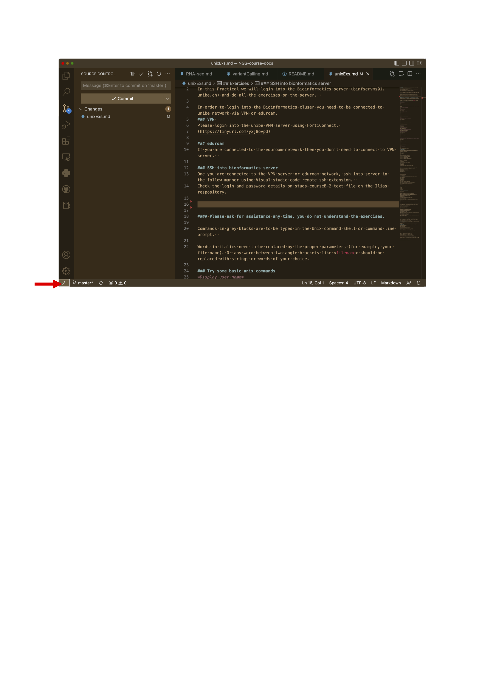
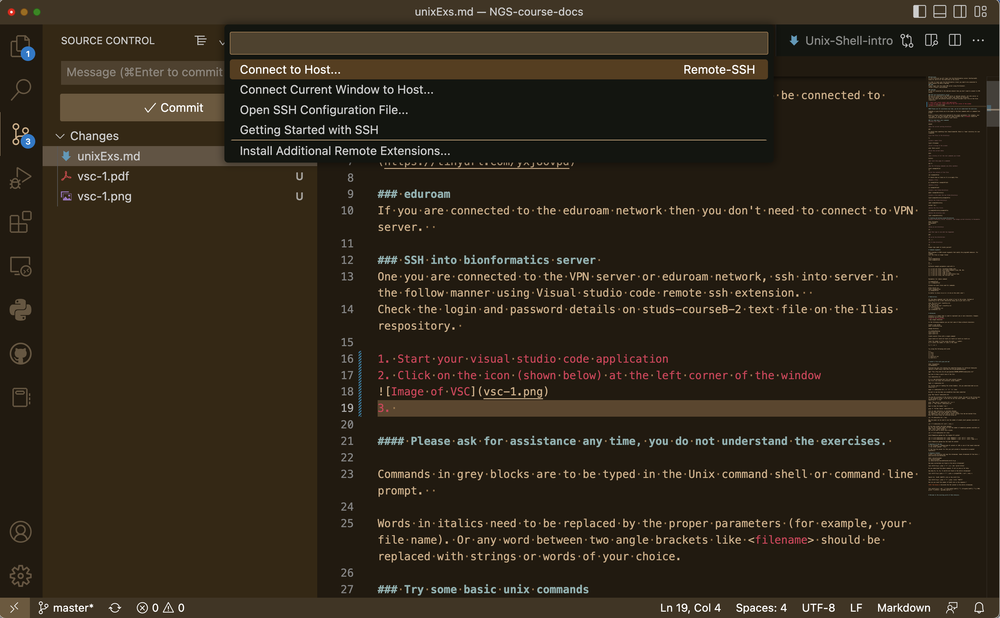
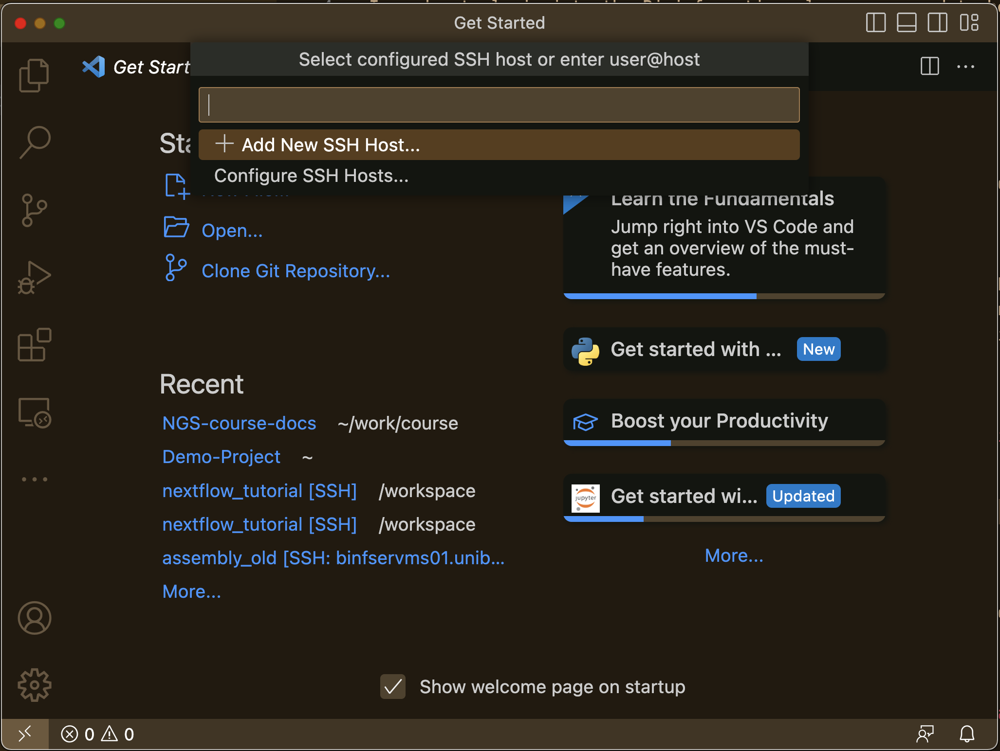
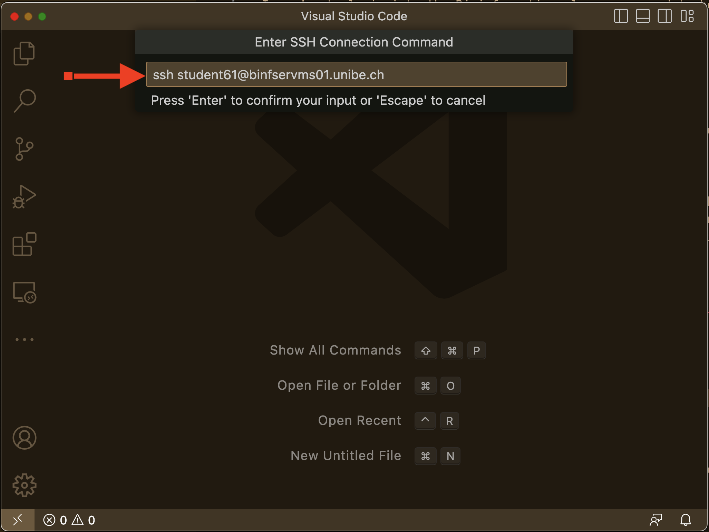
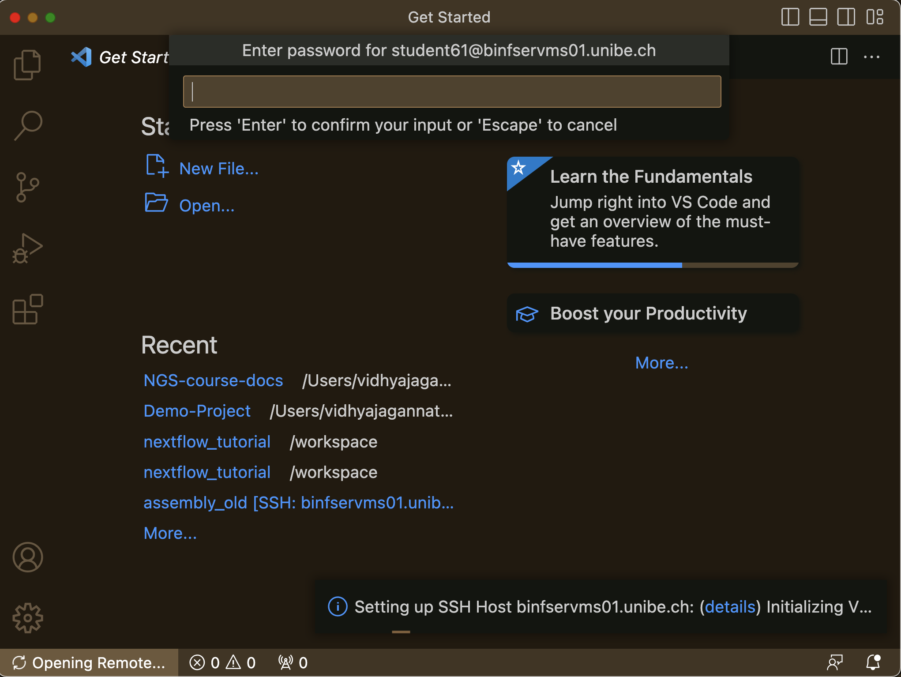

## Exercises 
In this Practical we will login into the Bioinformatics server (login8.hpc.binf.unibe.ch) and do all the exercises on the server.  

In order to login into the Bioinformatics cluser you need to be connected to unibe network via VPN or eduroam. 
### VPN 
Please login into the unibe VPN server using FortiConnect. 
(https://tinyurl.com/yxj8ovpd)

### eduroam
If you are connected to the eduroam network then you don't need to connect to VPN server.  

### SSH into bionformatics server 
After connecting to either the VPN server or eduroam network, use Visual Studio Code's Remote SSH extension to access the server.

Check the login and password details on students-passwords text file on the Ilias respository (https://ilias.unibe.ch/goto_ilias3_unibe_file_3222705_download.html). 

1. Start your visual studio code application
2.  Click on the icon (shown below) at the left corner of the window

3. It opens a sub-window as shown below. Click the Connect to Host 

4. Now its shows a sub-window as below. Click "Add New SSH Host"

5. Fill in the login details as shown below (replace your choosen student ID)

6. Click connect and  fill in the password on the password prompt

7. Click on the Terminal menu for a new terminal and you should see a window like below.


#### Please ask for assistance any time, you do not understand the exercises.

Commands in grey blocks are to be typed in the Unix command shell or command line prompt.(see the window above) 

Words in italics need to be replaced by the proper parameters (for example, your file name). *Or any word between two angle brackets like \<filename\> should be replaced with strings or words of your choice.*

### Try some basic unix commands
*Display user name*
```
whoami 
```
*Show the current working directory*
```
pwd 
```
It should show something like /home/student36. Which is 'home' directory for user student01

*List the files in the directory*	
```
ls 
```
*Create a empty file*	
```
touch <filename> 
```
*Print a string to the screen*
```
echo "Hello world" 
```
*Print the current date*
```
date
```
*See a history of all the last commands you tried* 
```
history 
```
*Get local help page of a command* 
```
man ls
```
*Run the following commands one after another*
```
touch <exampleFile>
ls
```
*Print the contents of the file* 
```
cat <exampleFile>
```
It should show no lines as it is an empty file. 

*Rename a file* 
```
mv <exampleFile> <exampleFile2>
```
*Delete a file* 
```
rm <exampleFile2>
```
*Create a new folder/directory* 
```
mkdir <exampleDirectory> 
```
*Create a file under the new folder/directory*
```
touch exampleDirectory/exampleFile
```
*Delete the folder/directory* 
```
rmdir exampleDirectory
```
worked ? No ! 

*Delete the file first* 
```
rm exampleDirectory/exampleFile
```
*Delete the directory now* 
```
rmdir exampleDirectory
```
# creating and moving around Directories 
*Create a directory called 'Documents' and change current directory to Documents* 
```
mkdir Documents 
cd Documents 
pwd
```
*Going up one directory* 
```
cd ..
```
*and then type to see what has happened*
```
pwd
```
*Go up by two directories* 
```
cd ../.. 
```
*Go to home directory* 
```
cd
```
Always type “pwd” to locate yourself

# Command arguments

Most programs in UNIX accept arguments that modify the program’s behavior. For example 
List the files in longer format 
```
ls -l 
touch exampleFile1
touch exampleFile2

ls
ls -l 
```
Different example parameters used with ls 
```
ls -a List all files, including hidden ones.
ls -h List all files, with human-readable sizes (Mb, Gb).
ls -l List all files, long format.
ls -S List all files, order by size.
ls -t List all files, order by modification time.
ls -1 List all files, one file per line.
```

Parameters for remove command 
```
rm exampleFile1
rm -i exampleFile2
```
Aliases are short forms used for commands. 
```
alias rm=”rm -i”
touch <exampleFile>
rm <exampleFile>
```
So better to alias rm as rm -i to be on the safer side ?.


# Redirection.

All the above commands sent the output if any to the screen. Instead of outputting on the screen redirection helps you to put into a file 
```
echo "My first line" >testFile.txt
cat testFile.txt 
echo "My second line" >>testFile.txt
cat testFile.txt
ls / >> ListRootDir.txt
cat ListRootDir.txt
```

# Wildcards

wildcard is a symbol that is used to represent one or more characters. Example wildcards are as follows 
* Zero or more characters
? Any single character. 

In the following examples you can test some of these wildcard characters 

Create a new folder 
mkdir wildCardTesting

Change directory 
```
cd wildCardTesting
touch test1.txt 
touch test2.txt 
```
Create several files with a single command 
```
touch test3.txt test4.txt test1.csv test2.csv test3.csv test4.csv
```
Count the number of files using the pipes ( | symbol) 
wc –l counts the number of lines in the input  
```
ls -l | wc -l 
```

Try using the following wild cards 
```
ls * 
ls test*
ls *.txt 
ls *.csv
ls test[1-2].txt 
ls test[!3].*
```

# subset a file with grep and awk
```
mkdir GenomeStats 
cd GenomeStats
```
Download the text file showing the available refseq genomes for different species at NCBI https://www.ncbi.nlm.nih.gov/genome/browse/
RefSeq Genomes on NCBI are high-quality reference genome sequences that serve as standard representations for the genetics of specific organisms
```
wget https://ftp.ncbi.nlm.nih.gov/genomes/refseq/assembly_summary_refseq.txt
```
Use less to have a quick view of the file 
```
less assembly_summary_refseq.txt
```
It is a tab delimited text file with several columns. 
The second line shows the different column headers
```
head -n 2 assembly_summary_refseq.txt | tail -n 1
```
For further ease of reading the column headers. (Do you understand what we are doing here ?)
```
head -n 2 assembly_summary_refseq.txt | tail -n 1 | tr '\t' '\n' |less
head -n 2 assembly_summary_refseq.txt | tail -n 1 | tr '\t' '\n' |nl |less
```
We want to see how many dog assemblies have been submitted 
```
awk -F'\t' '$8 == "Canis lupus familiaris" && $6 == "9615"' assembly_summary_refseq.txt
```

Want to keep the header line ? 
```
awk -F'\t' 'NR == 2 || ($1 == "Canis lupus familiaris" && $6 == "9615")' assembly_summary_refseq.txt

```
- NR == 2: NR is the current line number. NR == 2 allows the header line (second line) to be printed.
- '||': Logical OR, so it matches either the header line or lines that meet the specified condition.

Lets do some statistics on available Genomes 
How many Animal and plant genomes are available 
cut command in unix can be used to select columns from tab de-limited files 
Only the column Group can selected using cut 
```
cut -f25 assembly_summary_refseq.txt | less
```
Now the pipes can be used to see the number of different refseq genomes available at NCBI 
```
cut -f25 assembly_summary_refseq.txt | sort | uniq -c

```
We can skip the header line and before counting the genome groups in the column 25
```
tail -n +3 assembly_summary_refseq.txt | cut -f25 | sort | uniq -c
```
- tail -n +3 assembly_summary_refseq.txt: Outputs the file starting from the third line, effectively skipping the first two lines.
- cut -f25: Extracts the 25th column from the remaining lines.
- sort: Sorts the output to prepare for counting unique values.
- uniq -c: Counts occurrences of each unique value in the 25th column

*So how many mammalian genomes are available ?*
Now use cut and pipe symbol to find the number of mammalian genomes available at NCBI. (Hint: check column 25 for vertebrate_mammalian) 
cut can be used to select more columns 
```
cut -f 8,25,28 assembly_summary_refseq.txt |less
```
which Mammalian genome has the highest GC content 
```
cut -f 8,25,28 assembly_summary_refseq.txt | grep vertebrate_mammalian |sort -t$'\t' -nrk3 | less 
cut -f 8,25,28 assembly_summary_refseq.txt | grep vertebrate_mammalian |sort -t$'\t' -nrk3 | head -n 1
```
- sort: Sorts the filtered results.
- -t$'\t': Sets the field delimiter as a tab ($'\t' is a literal tab in Unix shell).
- -nrk3: Specifies sorting by the 3rd column in numerical order (-n), in reverse order (-r), based on column 3 (-k3).
- Result: Sorts entries in descending order based on GC% values.

* Which Mammalian genome has the least GC content ? * 

# Question of the day
Invertebrates generally have lower GC content compared to vertebrates.
You can check if this is true in your dataset
```
awk -F'\t' '$25 ~ /vertebrate_/ { total++; if ($28+0 < 40) count++ } END { print (count/total)*100, count, total }' assembly_summary_refseq.txt
awk -F'\t' '$25 ~ /invertebrate/ { total++; if ($28+0 < 40) count++ } END { print (count/total)*100, count, total }' assembly_summary_refseq.txt
```
- total++ If column 25 contains "vertebrate_" count total vertebrate genomes
- $28+0 converts column 28 (GC%) to a number. 
- count++ if GC content (column 28) is < 40% Count these low-GC genomes
- Output shows three numbers:Percentage of vertebrate genomes with GC<40%, Count of low-GC genomes, Total vertebrate genomes

# Sequence Content 
Create a new directory and copy the chromosome  human chromosome 22 from here: /data/courses/courseB/UnixEx
```
mkdir <directoryname>
cd <directoryname>
cp /data/courses/courseB/UnixEx/chr22.fa.gz  .
```
How many nucleotides are found in the entire chromosome? 
```
less chr22.fa.gz | grep -v ">" | wc | awk '{print $3-$1}'
```
Do you understand the above command. If not try man wc for help.

How many As, Cs, Gs, Ts and Ns are found in the entire chromosome?
```
less chr22.fa.gz |grep -v ">" | grep -o [actgnACTGN] | sort | uniq -c
```

Search for  EcoR1 (GAATTC) site in the chr22 file
```
less chr22.fa.gz | grep -v ">" | grep --color "GAATTC"
```
Now can you count the number of EcoR1 site in the sequence ? 

**For the brave.** Calculate the %GC content in the entire chromosome.

```
less chr22.fa.gz | awk '!/^>/{gc+=gsub(/[gGcC]/,""); at+=gsub(/[aAtT]/,"");} END{ printf "%.2f%%\n", (gc*100)/(gc+at) }'
```


# Welcome to the exciting world of Data Analysis.