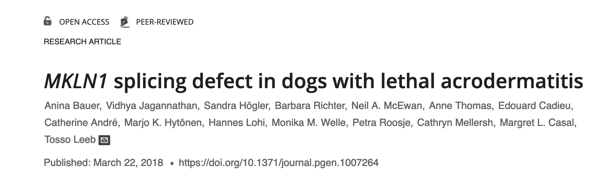

### Variant Calling 

For Variant calling we continue with the same Bull terrier dogs. 
One of the Bull Terrier dog suffers from Lethal acrodermatitis. 
Lethal acrodermatitis is a autosomal recessive hereditary disease in dogs. It is characterized by poor growth, immune deficiency and characteristic skin lesions of the paws and of the face.

The causative mutation findings have been published in [PLOS Genetics](https://journals.plos.org/plosgenetics/article?id=10.1371/journal.pgen.1007264)


We will use the mapped bam files of two Bull terrier dogs to repeat the same findings of this paper. 

#### Duplicate Marking 
Commonly seen issue with resequencing genomes is sequence duplication i.e. over representation of certain reads, which could be an read artifacts sampled from the exact template of DNA. This need to be identified and marked/removed as they could be overrepresented evidence for false variants. 

In the following exercise we will use the [_picard tools_](https://broadinstitute.github.io/picard/) to mark the duplicates, rather than remove them. Once they are marked the downstream  tools downweight them while looking for variants. 
 
 Change to directory mapping directory (_cd mapping_) and create the following script 
 ```
 #!/bin/bash
# Slurm options
#SBATCH --mail-type=fail,end
#SBATCH --job-name="markDuplicates"
#SBATCH --chdir=.
#SBATCH --time=3:00:00
#SBATCH --mem=2G

module add vital-it;
module add UHTS/Analysis/picard-tools/2.9.0;
picard-tools MarkDuplicates INPUT=BT134.sorted.bam OUTPUT=BT134.dedup.bam REMOVE_DUPLICAT=FALSE METRICS_FILE=BT134.marked_dup_metrics.txt
```
#### Task 
Repeat the same duplication marking with the BT012 genome bam file. 

#### Recalibration 

The next step in variant calling base quality recalibration. Many studies showed that the raw Phred-scaled quality scores were frequently inaccurate and hece the [_BQSR_ tool](https://software.broadinstitute.org/gatk/documentation/article?id=11081)  from  GATK recalibrates the base quality score to make them more accurately refelect the true error rate. 

As this step takes too long to finish we will skip this step for this exercises and move to variant calling with haplotypeCaller. 

#### HaplotypeCaller 
[_GATK HaplotypeCaller_](https://software.broadinstitute.org/gatk/documentation/tooldocs/4.0.8.0/org_broadinstitute_hellbender_tools_walkers_haplotypecaller_HaplotypeCaller.php) calls both SNP and indel variants simultaneously via local de-novo assembly of haplotypes. Essentially, when this variant caller finds a region with signs of variation, it tosses out the old alignment information (from BWA MEM) and performs a local realignment of reads in that region. 

We will first creare variants directory and create job script in the variant directory 
```
cd ../
mkdir variants
cd variants
```
In order to run the haplotypeCaller we need to create a index and dictionary file for the the reference using _samtools faidx_ and _picard-tools CreateSequenceDictionary_ respectively 

```
 #!/bin/bash
# Slurm options
#SBATCH --mail-user=<email_id>
#SBATCH --mail-type=fail,end
#SBATCH --job-name="varCalls"
#SBATCH --chdir=.
#SBATCH --time=3:00:00
#SBATCH --mem=2G

module add vital-it;
module add UHTS/Analysis/GenomeAnalysisTK/4.0.4.0;
module add UHTS/Analysis/picard-tools/2.9.0;
module add UHTS/Analysis/samtools/1.8;

samtools faidx ../refIdx/chr14.fa 
picard-tools CreateSequenceDictionary R=../refIdx/chr14.fa O=../refIdx/chr14.dict
GenomeAnalysisTK HaplotypeCaller -R  ../refIdx/chr14.fa -I ../mapping/BT012.dedup.bam -I ../mapping/BT134.dedup.bam  -O BT.vcf
```
The output is _variant call format_ or VCF file which is a tab delimited text file containing informations for the all the variants the tool found. 

#### Hard Filtering Variants 

In the next we will do hard filtering of variants using the statistical annotations that has produced haplotypeCaller. Each variant has statistical annotations like 
- how many reads covered it, 
- how many reads covered each allele, 
- what proportion of reads were in forward vs reverse orientation
- etc
In the hard filtering we set threshold for several of these annotations, and filter the variants that have values below this threshold or above the set thresholds. 

More information can be obtained on the [GATK hard filtering tutorial page](https://gatkforums.broadinstitute.org/gatk/discussion/6925/understanding-and-adapting-the-generic-hard-filtering-recommendations)

##### SelectVariants
Hard filtering is done for SNPs and Indels separately. So from the haplotypeCaller output VCF file first we will subset the SNPs and Indels using GATK's _SelectVariants_ tool. 

In the variants folder create the following script. 

```
#!/bin/bash
# Slurm options
#SBATCH --mail-user=<email_id>
#SBATCH --mail-type=fail,end
#SBATCH --job-name="selectSNVs"
#SBATCH --chdir=.
#SBATCH --time=1:00:00
#SBATCH --mem=2G

module add vital-it;
module add UHTS/Analysis/GenomeAnalysisTK/4.0.4.0;
module add UHTS/Analysis/picard-tools/2.9.0;
module add UHTS/Analysis/samtools/1.8;

GenomeAnalysisTK SelectVariants -V BT.vcf -select-type INDEL -O BT.indels.vcf
GenomeAnalysisTK SelectVariants -V BT.vcf -select-type SNP -O BT.snps.vcf

```

##### Variant Filtration 
Create the following script for filtering of Variants 

```
#!/bin/bash
# Slurm options
#SBATCH --mail-user=<email_id>
#SBATCH --mail-type=fail,end
#SBATCH --job-name="filterSNVs"
#SBATCH --chdir=.
#SBATCH --time=1:00:00
#SBATCH --mem=2G

module add vital-it;
module add UHTS/Analysis/GenomeAnalysisTK/4.0.4.0;
module add UHTS/Analysis/picard-tools/2.9.0;
module add UHTS/Analysis/samtools/1.8;

java -jar /software/UHTS/Analysis/GenomeAnalysisTK/4.0.4.0/bin/GenomeAnalysisTK.jar VariantFiltration -V BT.snps.vcf -O BT.flt.snps.vcf -filter "QD < 2.0" --filter-name "QD2" -filter "QUAL < 30.0" --filter-name "QUAL30" -filter "SOR > 3.0" --filter-name "SOR3" -filter "FS > 60.0" --filter-name "FS60" -filter "MQ < 40.0" --filter-name "MQ40" -filter "MQRankSum < -12.5" --filter-name "MQRankSum-12.5" -filter "ReadPosRankSum < -8.0" --filter-name "ReadPosRankSum-8"
java -jar /software/UHTS/Analysis/GenomeAnalysisTK/4.0.4.0/bin/GenomeAnalysisTK.jar VariantFiltration -V BT.indels.vcf -O BT.flt.indels.vcf -filter "QD < 2.0" --filter-name "QD2" -filter "QUAL < 30.0" --filter-name "QUAL30" -filter "FS > 200.0" --filter-name "FS200" -filter "ReadPosRankSum < -20.0" --filter-name "ReadPosRankSum-20"
```

Once the variants have been filtered we merge them to one single file for annotations. The vcfs are merged using GATK's _MergeVCFs_ tool 

```
#!/bin/bash
# Slurm options
#SBATCH --mail-user=<email_id>
#SBATCH --mail-type=fail,end
#SBATCH --job-name="mergeSNVs"
#SBATCH --chdir=.
#SBATCH --time=1:00:00
#SBATCH --mem=2G

module add vital-it;
module add UHTS/Analysis/GenomeAnalysisTK/4.0.4.0;
module add UHTS/Analysis/picard-tools/2.9.0;
module add UHTS/Analysis/samtools/1.8;
GenomeAnalysisTK MergeVcfs -I BT.flt.snps.vcf -I BT.flt.indels.vcf -O BT.flt.var.vcf
```
##### Task 
Use a Unix command to check: 
- total number of variants in the vcf file.
- total number "PASS" variants in the vcf file. 

#### Variant annotation and effect prediction 
 We will be using a software called [‘snpeff’](http://snpeff.sourceforge.net/) to annotate and predict the effect of the variants. 
 We will build an effect prediction database using our reference and annotation and then use that database to run effect prediction. This will give us a VCF file with an extra “ANN” field per variant, which will give us the effect of that variant.

The following script downloads the Effect database which we will use for for annotation and effect Prediction and also adds the annotation to the vcf file.  
```
#!/bin/bash
# Slurm options
#SBATCH --mail-user=<email_id>
#SBATCH --mail-type=fail,end
#SBATCH --job-name="Effdb"
#SBATCH --chdir=.
#SBATCH --time=1:00:00
#SBATCH --mem=2G
module add vital-it;
module add UHTS/Analysis/snpEff/4.3t;
snpEff  download -dataDir /home/<student>/variantCalling CanFam3.1.86
snpEff eff -dataDir /home/<student>/variantCalling CanFam3.1.86 BT.vcf >BT.ann.vcf
```
The output VCF file has an extra field "ANN"

##### Task 
1. use a unix command to check for ANN field in the VCF file. 
2. Use the following command to see if the variant implicated for the LAD in Bull terriers is found in the VCF file. 
```
 awk '{if($2 == 5731405) print $_}'  BT.ann.vcf 
```
##### Question 
In which genome is the variant found and what is the effect prediction for the variant. 